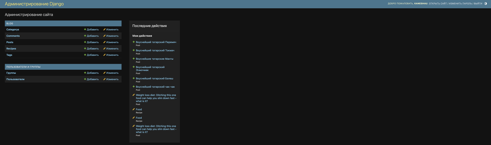
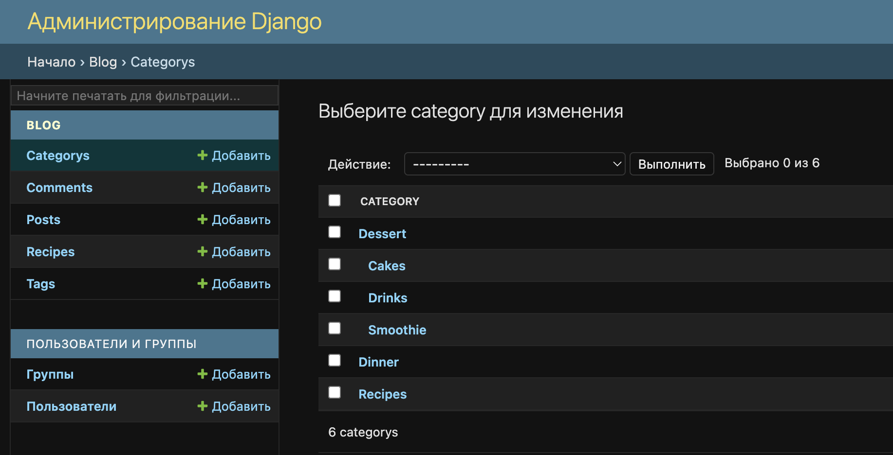
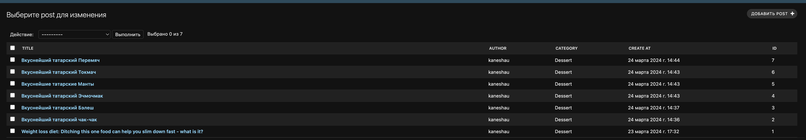
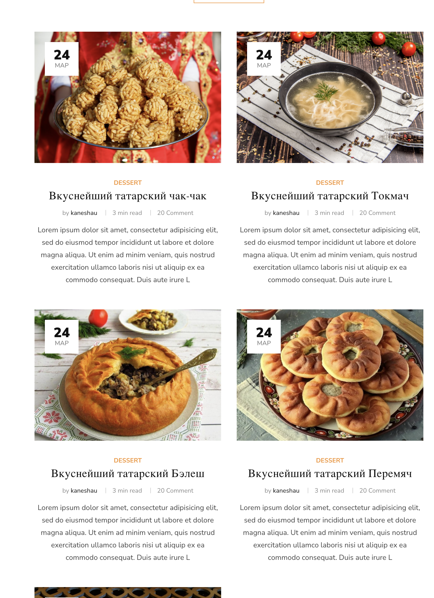

# django_chill
Сайт с рецептами с использованием Django для backend-части и стороннего frontend'a (html-ки допилены собственными силами для корректного отображения, css стили взяты исходные)


## CRUD
1. На сайте реализована стандартная модель CRUD (создание, чтение, обновление, удаление данных)
2. Сделать это можно, использовав панель администратора
> - Для этого перейдите по адресу ` /admin/` от корня `http://127.0.0.1:8000/admin/` по умолчанию
- Панель администратора: 
3. Для того, чтобы можно было создавать подкатегории использовалось дерево (**```MPTT (mptt.models)```**)


## Как пользоваться

> Перeйдите в папку `cook`
1. Для начала установите все зависимости командой: 
```
pip install -r requirements.txt
```
Рекомендую делать это используя окружение venv, прописав предварительно на macOs следующие команды:
```
python3 -m venv .venv
source bin/.venv/activate
```
Если python3 не работает, попробуйте python. Если это не помогло, установите заново себе python, либо проверьте что путь к интерпретатору лежит в переменной ```PATH```

2. Запустите сервер командой:
```
python manage.py runserver
```
Поздравляю, вы запустили сервер, можете перейти по адресу `http://127.0.0.1:8000/` для проверки работоспособности. Перед вами будет главная страница, на которой расположены посты, различные рецепты. Можете посмотреть подробнее, нажав на какой-либо из них. Также на этой странице можно читать и оставлять комментарии.

3. Если хотите добавить новый пост, вам нужна admin - панель (`http://127.0.0.1:8000/admin/`). 
Теперь вы можете видеть все посты на главной странице!


4. В проекте предусмотрена пагинация, поэтому при нажатии кнопки `LOAD MORE` загрузятся дополнительные 9 постов.

5. Если при переходе на панель администрирования у вас запрашивает логин и пароль, вам нужно их предварительно создать, вызвав команду в консоли:
```
python manage.py createsuperuser
```
И затем зайти под сохраненными логином - паролем.

> В дальнейшем функционал проекта будет дополняться.